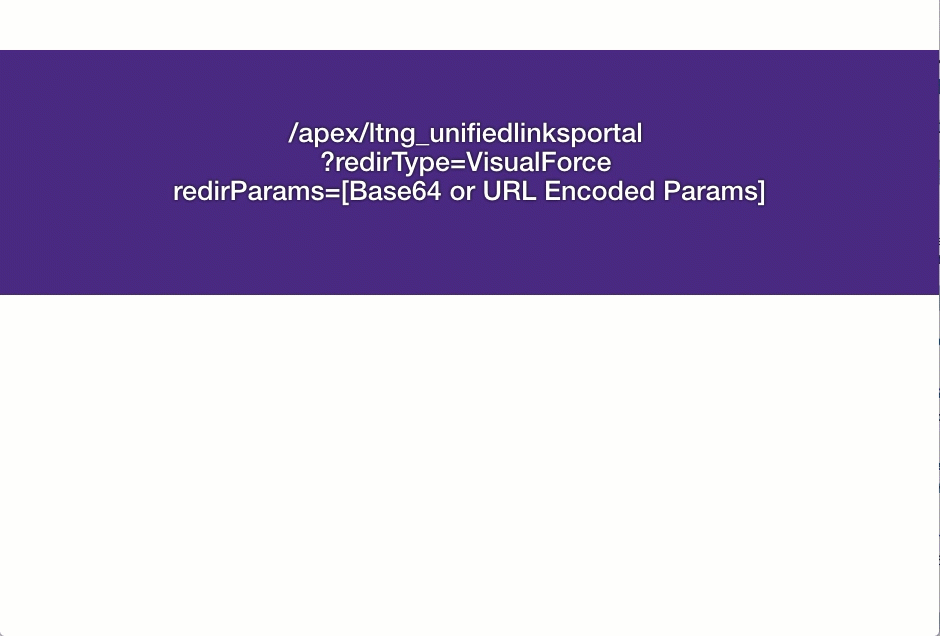
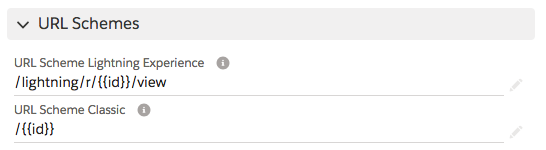
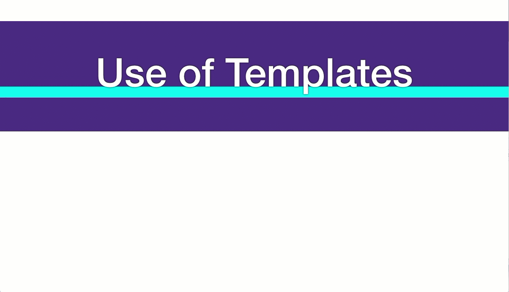
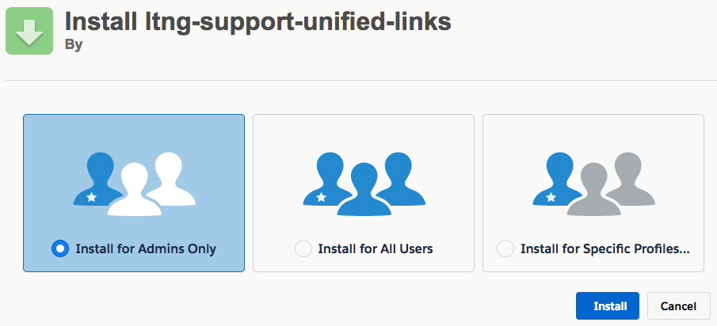
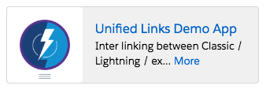
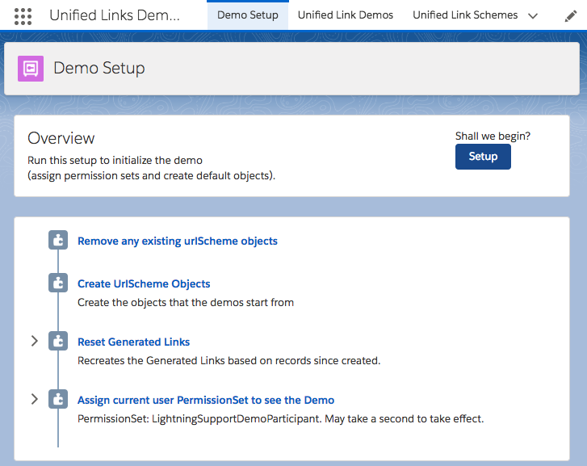
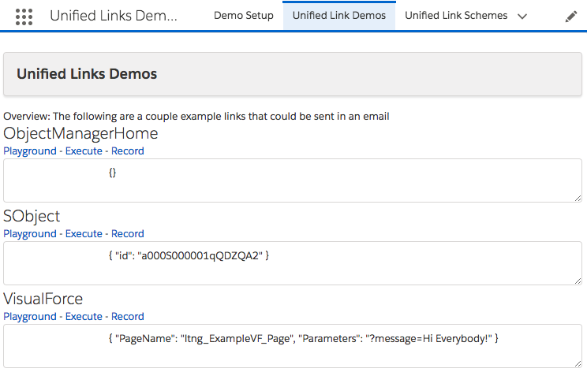

# Overview

Of the different ways of providing out Lightning Experience, the phased approach (with onboarding groups of people at a time vs a Big Bang approach) makes more sense.

But this begs the question, how can we provide links to people if some people are on Lightning Experience and some are on Classic (when both URLs can be so very different?)

**Please note: sample code (metadata api and dx formats) are available in the [mdapi](./mdapi) and [dx](./dx) folders above**

# Chatter Demo

The simplest means of sharing a record with some people on Lightning Experience and some people off is to send them through chatter.

Sending a reference to a record in chatter automatically converts to the environment you are on and will work in any context (Lightning Experience, Classic or Mobile)

# Robust Demo

Sometimes, we need to send links (through email or on records) - times where we cannot use chatter.

In this case, we can make a VisualForce page that can act as a portal between Classic and Lightning Experience.

In this case the links we can send should work "correctly" whether you are in Lightning Experience or Classic, as the Portal VisualForce page can navigate you correctly based on your user's preferences.

In this case, we defined an object to represent the types of Schemes that are supported (so they can be available by sharing and other visibility efforts).

And then use the templating (Mustaches {{}}) to translate the parameters sent to the type of URL we would use based on context we are in.

So that the same link works within Classic, and Lightning Experience.

# TLDR How

**1.** In this demonstration, we created an SObject that includes a Templated Classic and Lightning URLs.

So the parameters that we send can either be base64 / URL Encoded or as Separate URL Parameters.

For example:

	{ "id": "a00R000000Eo2IZIAZ" }
	
For the Redirect type of: `SObject`

would be applied to the URL Schemes above to provide the following for a Lightning enabled user:
	
	/lightning/r/a00R000000Eo2IZIAZ/view
	
or the following for a Classic user:

	/a00R000000Eo2IZIAZ

**2.** We would then need to generate links.

In Apex, I can easily encode using either:
	
	String redirectParams = '{"id":"a00R000000Eo2ItIAJ"}';
	
	String base64Encoded = EncodingUtil.base64Encode( Blob.valueOf(redirectParams))
	
	String resultUrl = '/apex/ltng_unifiedlinksportal?' +
			'redirType=SObject' + 
			'&redirParams=' + base64Encoded;

Or URL Encoding

	String urlEncoded = EncodingUtil.urlEncode(redirectParams, 'UTF-8');
	
	String resultUrl = '/apex/ltng_unifiedlinksportal?' +
			'redirType=SObject' + 
			'&redirParams=' + urlEncoded;

In Formula fields, the simplest is to simply send parameters matching the same Mustache key:  
(keep in mind that strings to be sent should be sanitized first)

	HYPERLINK(
	/* URL */
		'/apex/ltng_unifiedlinksportal?redirType=SObject&id=' + Id,
		/* Friendly Name */
		'Link to this Record',
		/* Target */
		'_blank'
	)

Or we can use Custom Links with the `URLEncode` function

	/apex/ltng_unifiedlinksportal?redirType=SObject&redirParams={!URLENCODE('{"id": "' +  ltng_UnifiedLinkScheme__c.Id + '"}')}
	
-----

Conversely, we can encode using Base64 - using Apex:
(Typically used in Emails, etc)

	EncodingUtil.base64Decode(paramsStr).toString();

---

# Install

There are three methods available for you to install this demo, so you can play around with it:

(Please note, all are intended as demonstrations and are not intended for deployment to Production as is)

* [Install via URL](#install-via-url)
* [Install Demo via Salesforce CLI](#install-via-salesforce-cli)
* [Install Demo via Ant/Metadata API](#install-via-metadata-api)

## Install via URL

This works very similar to an App Exchange install.

Please login to an available sandbox and click the link below.

[https://test.salesforce.com/packaging/installPackage.apexp?p0=04t6A000002stOcQAI](https://test.salesforce.com/packaging/installPackage.apexp?p0=04t6A000002stOcQAI)

(or simply navigate to `https://YOUR_SALESFORCE_INSTANCE/packaging/installPackage.apexp?p0=04t6A000002stOcQAI`  
if you are already logged in)

It is recommended to install for Admins Only (but all options will work)

##### Run Demo Setup

Next, click on the 'dice' and open the 'Unified Links Demo' app.

and run `Setup` from the `URL Hack Demo Setup` tab.

This will then perform any additional setup (such as creating records, etc).

##### Run the Demos

Thats it, all information should be avaiable for running all demos now from the `Unified Link Demos` tab.

* Playground - defaults values and allows updating before running
* Execute - simply runs the link
* Record - opens to the Record to see how it is set up

## Installing via the Salesforce CLI

This assumes you have already installed the [Salesforce CLI]() and [Connected the Salesforce CLI to your org](https://developer.salesforce.com/docs/atlas.en-us.sfdx_dev.meta/sfdx_dev/sfdx_dev_auth_web_flow.htm).

However, the Salesforce CLI can be used with any org and does not require Salesforce DX to be enabled. (Although enabling the DX / Dev Hub would give some great benefits, and would only require care of [certain object permissions: Scratch Org Info, ActiveScratchOrg, NamespaceRegistry](https://developer.salesforce.com/docs/atlas.en-us.sfdx_setup.meta/sfdx_setup/sfdx_setup_add_users.htm) - as they are not available in all orgs)

**1.** Run the following command:

	sfdx force:mdapi:deploy -d mdapi -u [[orgAlias]] -w

**2.** Add the permission set to your user

	sfdx force:user:permset:assign -n UnifiedLinksDemoParticipant -u [[orgAlias]]
	
**3.** Upload the data

	sfdx force:data:tree:import -f data/tree/ltng_UnifiedLinkScheme__c.json -u [[orgAlias]]
	
...

Thats it, you can now open the org, and find the 'ticket' object in the 'all tabs' search.

	sfdx force:org:open -u [[orgAlias]]

# Bit more detail...

The redirector must be a VisualForce page (as Lightning Pages are not supported in Classic)

We then determine if the User would prefer Lightning Experience through the [following permission: UserPreferencesLightningExperiencePreferred](https://developer.salesforce.com/docs/atlas.en-us.api.meta/api/sforce_api_objects_user.htm#UserPreferencesLightningExperiencePreferred) and SOQL Query:

	SELECT Id, UserPreferencesLightningExperiencePreferred
            FROM User
            WHERE Id = :targetUserId
            LIMIT 1

Within Summer '18, we now also have [checkPermission from Feature Management](https://developer.salesforce.com/docs/atlas.en-us.apexcode.meta/apexcode/apex_class_System_FeatureManagement.htm#apex_System_FeatureManagement_checkPermission)

	System.FeatureManagement.checkPermission( PERM_LEX_ENABLED )
	
We then can replace the template, and redirect the user on 'page action'
