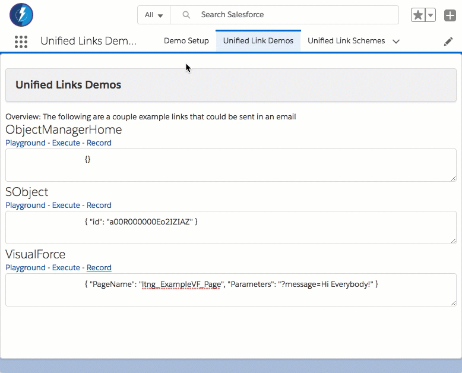

# Overview

Of the different ways of providing out Lightning Experience, the phased approach (with onboarding groups of people at a time vs a Big Bang approach) makes more sense.

But this begs the question, how can we provide links to people if some people are on Lightning Experience and some are on Classic (when both URLs can be so very different?)

**Please note: sample code (metadata api and dx formats) are available in the [mdapi](./mdapi) and [dx](./dx) folders above**

# Chatter Demo

The simplest means of sharing a record with some people on Lightning Experience and some people off is to send them through chatter.

Sending a reference to a record in chatter automatically converts to the environment you are on and will work in any context (Lightning Experience, Classic or Mobile)

# Robust Demo

Sometimes, we need to send links (through email or on records) - times where we cannot use chatter.

In this case, we can make a VisualForce page that can act as a portal between Classic and Lightning Experience.

In this case the links we can send should work "correctly" whether you are in Lightning Experience or Classic, as the Portal VisualForce page can navigate you correctly based on your user's preferences.

In this case, we defined an object to represent the types of Schemes that are supported (so they can be available by sharing and other visibility efforts).

And then use the templating (Mustaches {{}}) to translate the parameters sent to the type of URL we would use based on context we are in.

So that the same links that work within Lightning Experience:

Would also work for those in Classic

# TLDR How

** 1. ** In this demonstration, we created an SObject that includes a Templated Classic and Lightning URLs.

So the parameters that we send can either be in base64 or URL Encoded formats.

For example:

	{ "id": "a00R000000Eo2IZIAZ" }
	
For the Redirect type of: `SObject`

would provide the URL of:
	
	https://YOUR_DOMAIN/apex/ltng_unifiedlinksportal?redirType=SObject&redirParams=eyAiaWQiOiAiYTAwUjAwMDAwMEVvMklaSUFaIiB9

or

	https://YOUR_DOMAIN/apex/ltng_unifiedlinksportal?redirType=SObject&redirParams=%7B%20%22id%22%3A%20%22a00R000000Eo2IZIAZ%22%20%7D

Either would work.

---

# Install

There are three methods available for you to install this demo, so you can play around with it:

(Please note, all are intended as demonstrations and are not intended for deployment to Production as is)

* [Install via URL](#install-via-url)
* [Install Demo via Salesforce CLI](#install-via-salesforce-cli)
* [Install Demo via Ant/Metadata API](#install-via-metadata-api)

## Install via URL

This works very similar to an App Exchange install.

Please login to an available sandbox and click the link below.

[https://test.salesforce.com/packaging/installPackage.apexp?p0=04t6A000002sreiQAA](https://test.salesforce.com/packaging/installPackage.apexp?p0=04t6A000002sreiQAA)

(or simply navigate to `https://YOUR_SALESFORCE_INSTANCE/packaging/installPackage.apexp?p0= 04t6A000002sreiQAA`  
if you are already logged in)

It is recommended to install for Admins Only (but all options will work)

##### Run Demo Setup

Next, click on the 'dice' and open the 'URL Hack Demo' app.

and run `Setup` from the `URL Hack Demo Setup` tab.

This will then perform any additional setup (such as creating records, etc).

##### Run the Demos

Thats it, all information should be avaiable for running all demos now from the `URL Hack Bases` tab.

Feel free to create your own and to create children through the QuickActions, Lightning Actions or List View buttons.

#### -- Known Issue -- Add the missing permissions on the permission set

If you get an error saying 'This record is not available' (when creating records),
you are likely affectd by a known issue with Unlocked Package deploys.

(This is also mentioned from the Setup page)

We are working with different teams, but it appears as though the installation works correctly from Salesforce CLI, but requires additional steps from the insllation URL.

**We appologize for this inconvenience and are working towards correcting it**

**1.** Navigate to the 'Dependent Picklist Demo' app

**2.** Navigate to the 'Dependent Picklist Demo Setup' page

and click on the link **Add the 'Master', 'Type A' and 'Type B' record types to the permission set'**

This will navigate you to the permission set in your org.

**3.** Click edit and enable the record types for that permission set.

## Installing via the Salesforce CLI

This assumes you have already installed the [Salesforce CLI]() and [Connected the Salesforce CLI to your org](https://developer.salesforce.com/docs/atlas.en-us.sfdx_dev.meta/sfdx_dev/sfdx_dev_auth_web_flow.htm).

However, the Salesforce CLI can be used with any org and does not require Salesforce DX to be enabled. (Although enabling the DX / Dev Hub would give some great benefits, and would only require care of [certain object permissions: Scratch Org Info, ActiveScratchOrg, NamespaceRegistry](https://developer.salesforce.com/docs/atlas.en-us.sfdx_setup.meta/sfdx_setup/sfdx_setup_add_users.htm) - as they are not available in all orgs)

**1.** Run the following command:

	sfdx force:mdapi:deploy -d mdapi -u [[orgAlias]] -w

**2.** Add the permission set to your user

	sfdx force:user:permset:assign -n UnifiedLinksDemoParticipant -u [[orgAlias]]
	
**3.** Upload the data

	sfdx force:data:tree:import -f data/tree/ltng_UnifiedLinkScheme__c.json -u [[orgAlias]]
	
...

Thats it, you can now open the org, and find the 'ticket' object in the 'all tabs' search.

	sfdx force:org:open -u [[orgAlias]]

# Bit more detail...

More_detail_on_how_this_was_done

## Component

What_about_the_component

	sample code
	
